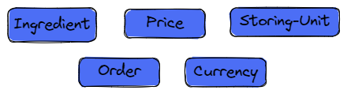
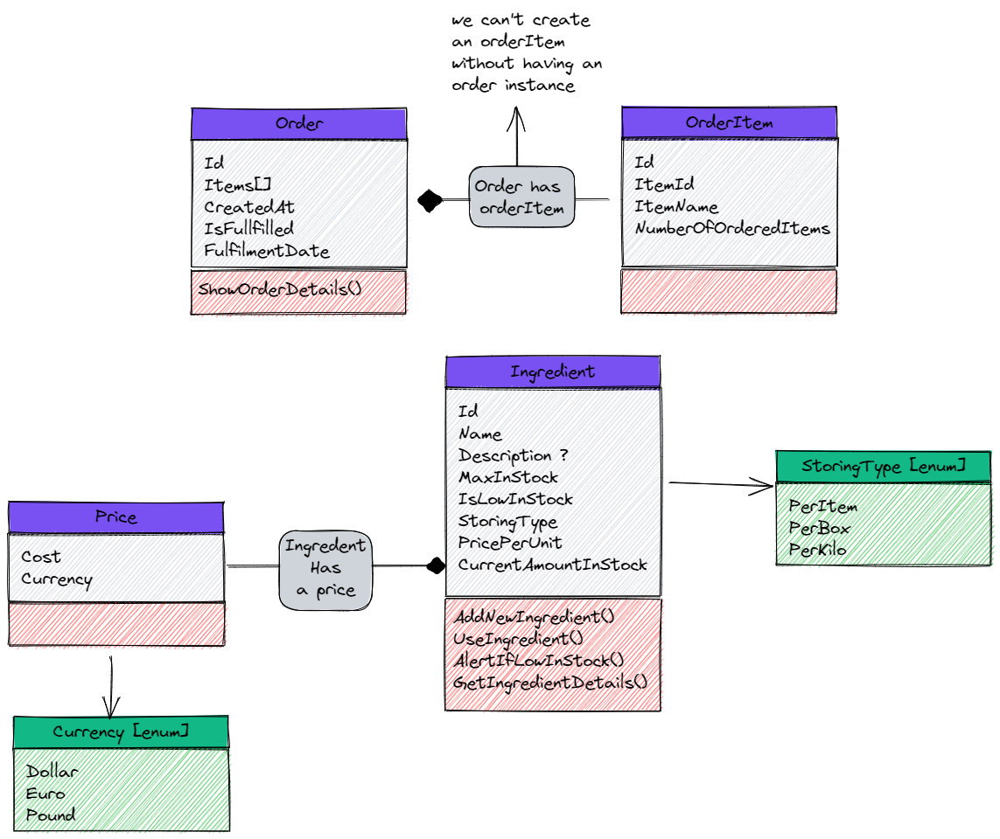

# OOP-bakery-inventory-management-System-Csharp10

### `The application idea`
we need to implement an application for the management of an inventory of ingredients so that the bakery managers can continue baking thier items.

- managers need to know when some ingredients are too low in the stock so they can decide what to put in their menu for today.

- when an ingredient is used to make an item, its stock must be updated.

- some products are stored and used per item, and some are stored per kilo (ex. : flour), and some are stored by box (ex. : eggs).

- inventory managers (users of our app) can create new order/s to increase the amount of ingredient/s in the stock.

- inventory managers deal with different supplies, and they purchase ingredients by different currencies.

- inventory managers can add new ingredient to the stock.

### `Entities` 

### `high-level class diagram`
